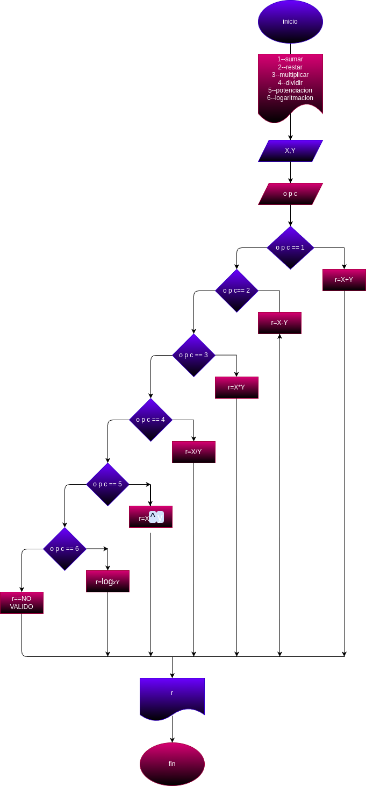

# miniCalculadoraGuanentina
Una mini calculadores capaz de resolver las funciones basicas.

# Programa #1
Programa para calcular el area y el perimetro de un circulo de radio r
# Analisis 

## Input
### Variables de entrada
x: Variable 1
y:Variable 2
r:Resultado
Opcion 1:suma
Opcion 2: resta
Opcion 3: multiplicacion
Opcion 4: division
Opcion 5: potenciacion
Opcion 6:logaritmacion

### Processing
Opcion 1= X+Y
Opcion 2= X-Y
Opcion 3= X*Y
Opcion 4= X/Y
Opcion 5= X^Y
Opcion 6= logx Y
### output
X,Y

# Diseño

# Construccion